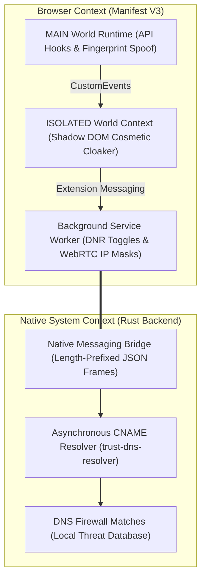
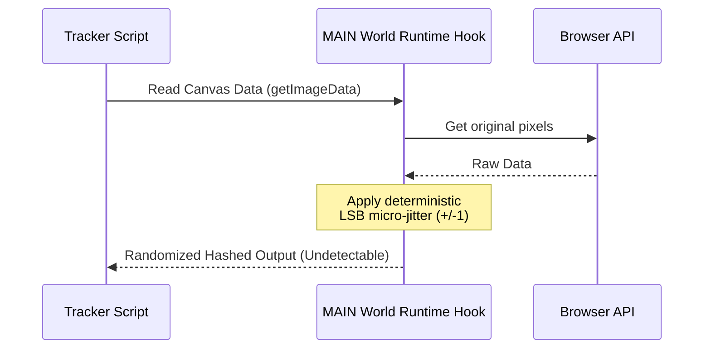
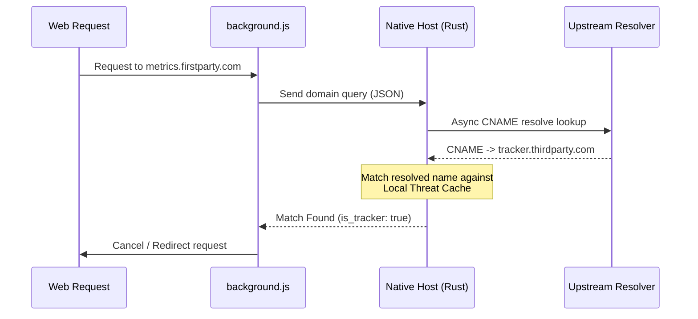

# 🛡️ Stealth Blocker Pro

[]()
[]()
[]()

**Stealth Blocker Pro** is a hybrid ad and tracker blocker. It stops analytical scripts, bypasses anti-adblock detection, and resolves DNS-level cloaked trackers.

The system combines a lightweight **Manifest V3 Extension** (handling UI, DOM hiding, and dynamic script mocking) with a high-performance native **Rust Core Resolver** (performing async DNS lookups) connected via Chrome Native Messaging.

---

## 🏛️ System Architecture

Our hybrid architecture isolates browser-level UI interactions from native system-level DNS scanning:



---

## ⚡ Main Engines & Functions

### 1. 🎭 Stealth Fingerprint Shield (Main World)
Modern trackers scan APIs to identify blocker extensions. Stealth Blocker overrides these APIs directly in the page's context before detection scripts run:



*   **Canvas & WebGL Protection**: Inserts micro-jitter noise into pixel readbacks (`getImageData`, `readPixels`), changing the canvas checksum without visible distortion.
*   **Audio Protection**: Hooks `AudioContext` frequency analysis to add micro-decibel frequency jitter.
*   **Navigator Mask**: Spoofing parameters (`navigator.webdriver` to `false`, core values to 8 cores and 8GB RAM) to bypass bot flags.

### 2. 🪄 Dynamic Shadow DOM Traverser (Cosmetic Shield)
Hiding ad slots without triggering detection:
*   **Shadow DOM Drill**: Recursively traverses encapsulated shadow roots (`element.shadowRoot`) to remove nested ad units.
*   **DOM Cloaking**: Generates session-randomized CSS class names (e.g. `.stlh-h8a2x`) to apply styling, blocking detection scripts that search stylesheets for static classes like `.ad-banner`.
*   **Frame Optimizer**: Schedules DOM removals inside `requestAnimationFrame` blocks using a root `MutationObserver` to prevent rendering lag.

### 3. 🦀 Native CNAME Tracker Unmasker (Rust Backend)
Trackers frequently bypass browser lists by using first-party subdomains (e.g. `analytics.firstparty.com` pointing to `tracker.thirdparty.com`).



---

## 📂 Project Directory Structure

```
stealth-blocker/
├── extension/                       # Manifest V3 Extension Source
│   ├── manifest.json                # Extension Manifest & Permissions
│   ├── rules.json                   # Static Declarative Net Request Block Rules
│   ├── background.js                # Core Background orchestrator & Client Bridge
│   ├── content_main.js              # MAIN World Jittering and Suppressor hooks
│   ├── cosmetic.js                  # Dynamic DOM Cloaker & Shadow Root hider
│   ├── content_isolated.js          # Isolated World events listener
│   ├── popup.html                   # Dashboard Structure
│   ├── popup.css                    # Glassmorphic Stylesheet
│   ├── popup.js                     # Dynamic Sync Controls & Counter animations
│   ├── icons/                       # Gradient Extension Assets (16px - 128px)
│   └── scriptlets/                  # Redirect targets for mock analytics libraries
│       ├── ga_mock.js               # Mock object for Google Analytics (ga)
│       └── gtag_mock.js             # Mock object for Google Tag Manager (gtag)
├── native-backend/                  # High-performance Rust Native Messaging Host
│   ├── Cargo.toml                   # Rust Project Dependencies
│   └── src/
│       ├── main.rs                  # Core Native Messaging IO loops
│       ├── bridge.rs                # Length-prefixed JSON messaging frame decoder
│       ├── uncloaker.rs             # Asynchronous recursive DNS CNAME resolver
│       └── dns_firewall.rs          # Local threats matching engine
└── scripts/                         # Installer & Setup scripts
    ├── generate_icons.py            # Automated PNG builder utility
    ├── stealth_blocker_host.json    # Native Messaging host registration template
    └── install_host.ps1             # Powershell Auto-installer for registry keys
```

---

## 🚀 Easy Setup Guide

### Option A: Local Shield Only (Immediate Run)
Test the core extensions shields instantly:
1. Open your browser and navigate to `chrome://extensions`.
2. Toggle on **Developer mode** (top-right).
3. Click **Load unpacked** (top-left) and select the `extension` folder inside the project path:
   `[project-root]/extension`
4. The extension is now running! Toggles in the popup dashboard govern the active local engines.

---

### Option B: Rust Core Active (Full CNAME Unmasking)
To enable native DNS tracker unmasking:

#### 1. Compile the Host Crate
Ensure you have Rust installed ([rustup.rs](https://rustup.rs/)). Open your terminal in the backend directory and compile:
```bash
cd native-backend
cargo build --release
```

#### 2. Register the Messaging Host
1. Copy the 32-letter **Extension ID** displayed on your loaded extension in `chrome://extensions`.
2. Open PowerShell and run the registration script, replacing the ID argument:
   ```powershell
   powershell -File ".\scripts\install_host.ps1" -ExtensionId "<YOUR-EXTENSION-ID>"
   ```
3. Reload the browser extension. The popup status will switch to **"Rust Core Active"**!

---

## 🤝 Open-Source Contribution

We welcome contributions to strengthen Stealth Blocker Pro! Feel free to open a PR for any of the following active roadmap targets:

*   **🌐 Cross-Platform Installers**: Help us build Bash scripts (`install_host.sh`) to automatically register native messaging paths on macOS and Linux.
*   **🧠 Heuristic Tracker Classifier**: Build lightweight client-side behavioral checks inside `background.js` to identify and restrict anomalous script activity.
*   **⚡ DNS Lookup Cache**: Integrate an SQLite backend cache in `dns_firewall.rs` to persist resolved DNS entries locally, reducing repetitive network roundtrips.
*   **🛡️ Custom Mock Scriptlets**: Add synthetic mock libraries under `extension/scriptlets/` for complex tracking networks.
